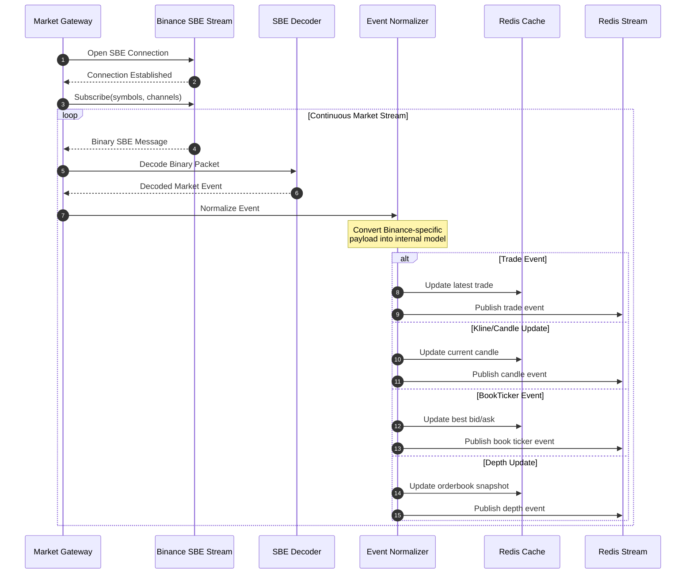

```mermaid
sequenceDiagram
    autonumber

    participant Gateway as Market Gateway
    participant Binance as Binance SBE Stream
    participant Decoder as SBE Decoder
    participant Normalizer as Event Normalizer
    participant Redis as Redis Cache
    participant Queue as Redis Stream

    Gateway->>Binance: Open SBE Connection

    Binance-->>Gateway: Connection Established

    Gateway->>Binance: Subscribe(symbols, channels)

    loop Continuous Market Stream

        Binance-->>Gateway: Binary SBE Message

        Gateway->>Decoder: Decode Binary Packet

        Decoder-->>Gateway: Decoded Market Event

        Gateway->>Normalizer: Normalize Event

        Note over Normalizer: Convert Binance-specific<br/>payload into internal model

        alt Trade Event

            Normalizer->>Redis: Update latest trade

            Normalizer->>Queue: Publish trade event

        else Kline/Candle Update

            Normalizer->>Redis: Update current candle

            Normalizer->>Queue: Publish candle event

        else BookTicker Event

            Normalizer->>Redis: Update best bid/ask

            Normalizer->>Queue: Publish book ticker event

        else Depth Update

            Normalizer->>Redis: Update orderbook snapshot

            Normalizer->>Queue: Publish depth event

        end

    end
```