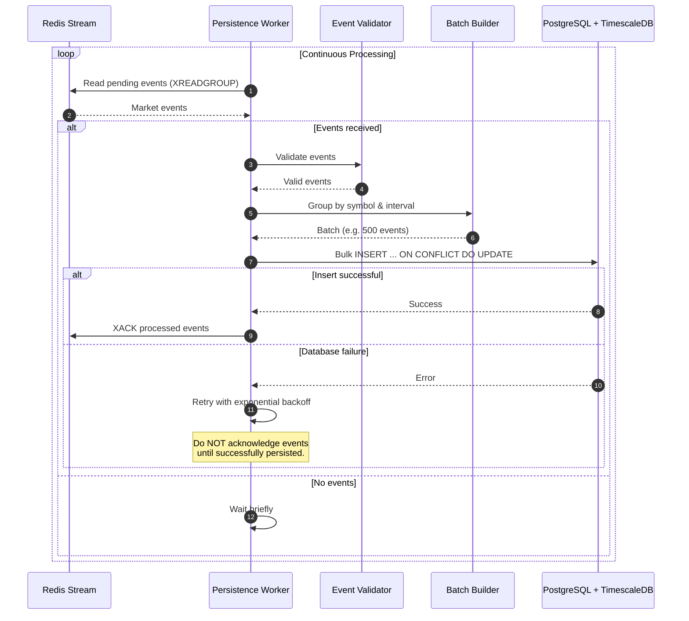

```mermaid
sequenceDiagram
    autonumber

    participant Stream as Redis Stream
    participant Worker as Persistence Worker
    participant Validator as Event Validator
    participant Batcher as Batch Builder
    participant DB as PostgreSQL + TimescaleDB

    loop Continuous Processing

        Worker->>Stream: Read pending events (XREADGROUP)

        Stream-->>Worker: Market events

        alt Events received

            Worker->>Validator: Validate events

            Validator-->>Worker: Valid events

            Worker->>Batcher: Group by symbol & interval

            Batcher-->>Worker: Batch (e.g. 500 events)

            Worker->>DB: Bulk INSERT ... ON CONFLICT DO UPDATE

            alt Insert successful

                DB-->>Worker: Success

                Worker->>Stream: XACK processed events

            else Database failure

                DB-->>Worker: Error

                Worker->>Worker: Retry with exponential backoff

                Note over Worker: Do NOT acknowledge events<br/>until successfully persisted.

            end

        else No events

            Worker->>Worker: Wait briefly

        end

    end
```