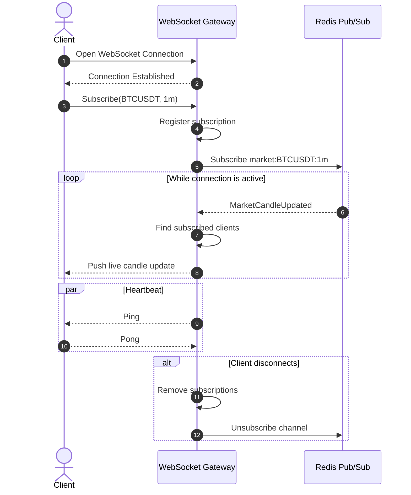

```mermaid
sequenceDiagram
    autonumber

    actor Client

    participant Gateway as WebSocket Gateway
    participant Redis as Redis Pub/Sub

    Client->>Gateway: Open WebSocket Connection

    Gateway-->>Client: Connection Established

    Client->>Gateway: Subscribe(BTCUSDT, 1m)

    Gateway->>Gateway: Register subscription

    Gateway->>Redis: Subscribe market:BTCUSDT:1m

    loop While connection is active

        Redis-->>Gateway: MarketCandleUpdated

        Gateway->>Gateway: Find subscribed clients

        Gateway-->>Client: Push live candle update

    end

    par Heartbeat

        Gateway-->>Client: Ping

        Client-->>Gateway: Pong

    end

    alt Client disconnects

        Gateway->>Gateway: Remove subscriptions

        Gateway->>Redis: Unsubscribe channel

    end
```